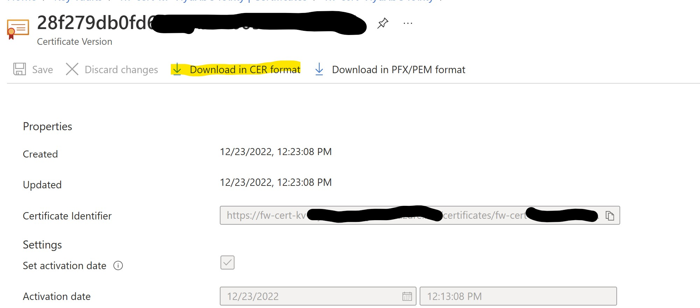
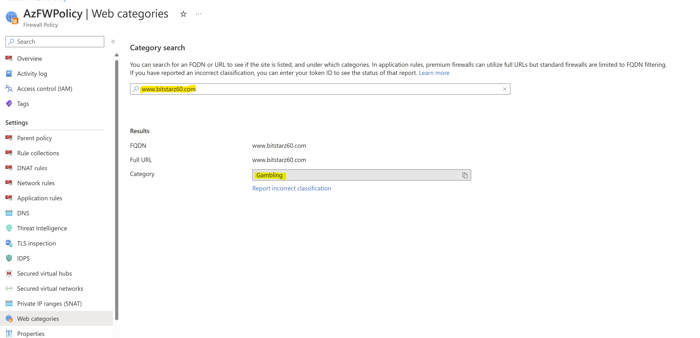
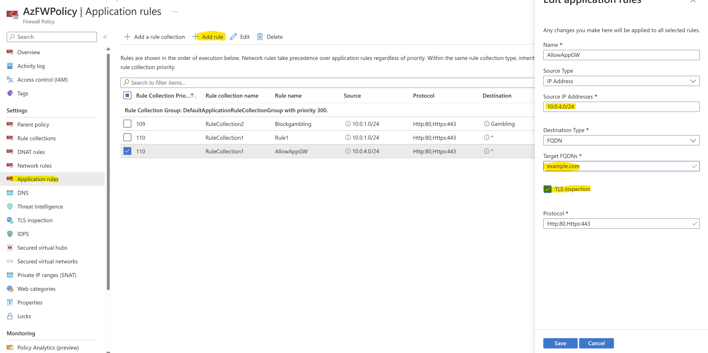
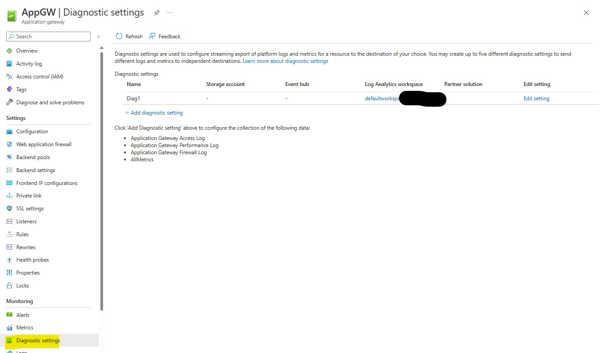

## TABLE OF CONTENT

[Intro](#intro)

[Deployment and preliminary configurations](#deployment-and-preliminary-configurations)

[CHALLENGE 1: IDPS for unencrypted traffic](#challenge1--idps-for-unencrypted-traffic)

[CHALLENGE 2: TLS Inspection and IDPS on encrypted traffic](#challenge-2-tls-inspection-and-idps-on-encrypted-traffic)

[CHALLENGE 3 (Optional): Block specific Web Categories](#challenge-3-optional-block-specific-web-categories)

[CHALLENGE 4 (Optional): Block specific URL paths]

[CHALLENGE 5: Application Gateway & Azure Firewall chain with TLS inspection](#challenge-4-application-gateway--azure-firewall-chain-with-tls-inspection)

## INTRO

In this microHack we will test some of the most interesting functionalities introduced by Azure Firewall Premium SKU


The environment is composed by a simple Windows VM with internet traffic protected by Azure Firewall Premium.

In the last challenge we will introduce an Application Gateway with WAF protection, to simulate the commonly used chained topology (AppGW + FW) for exposing applications to the Internet leveraging both WAF + IDPS protection layers.

All is deployed in the same VNET with no particular routing configurations.


# DEPLOYMENT AND PRELIMINARY CONFIGURATIONS

## TASK1

Let's start with the deployment of the environment:

-Log in to Azure Cloud Shell at https://shell.azure.com/ and select Bash

-If necessary select your target subscription:

```
azure account set -s {Subscription Id}
```

-Clone the GitHub repository:

```
git clone https://github.com/Danieleg82/AzFirewallPremium-MH
```

-Change directory:

```
cd ./AzFirewallPremium-MH/Terraform/Main
```

-Initialize terraform and download the azurerm resource provider:

```
terraform init
```

-Now start the deployment (when prompted, confirm with yes to start the deployment):

```
terraform apply
```
At the end of deployment phase, you will see the following resources under resource group named **AzFirewallPremimTest**:

- A VNET (VNET1) hosting:
- A client VM named VM1 (credentials --> Username: adminuser / Pwd: AzFWPa$$w0rd) 
- An Azure FIrewall Premium named AzFW bound to relevant Firewall Policy
- A Bastion subnet and Bastion host for the remote connectivity


## TASK2

After our environment is deployed, let's proceed as first step with enabling Diagnostic logging on the FW.

If neended, create a LogAnalytics workspace where to host the FW logs.


# CHALLENGE1:  IDPS for unencrypted traffic

## TASK1

We will now proceed creating a basic outbound ApplicationRule which will initially allow any kind of outbound internet connection from our internal subnet.

Let's find our FW Policy from portal and let's select "Add a rule collection" under the "Application rules" section


The rule will have the following characteristics:

- Collection Name: RuleCollection1
- Type: Application
- Priority: 110
- Action: ALLOW
- Rule Name: Rule1
- Sourcetype = IP address
- Source = 10.0.1.0/24 
- Protocols: http:80,https
- TLS Inspection: initially DISABLED
- Destinationtype = FQDN
- Destination: ANY


Click ADD to apply the change to the policy

## TASK2

Let's now go ahead enabling IDPS on our FW.
This will be set in Alert & Deny mode.

Since TLS Inspection is initially disabled, we will see how protection works exclusively for unencrypted (HTTP) traffic.

Let's select our FW Policy and locate IDPS section in the portal.
Let's choose "Alert & Deny" option and Apply changes:


## TASK3

We're now ready to test IDPS functionalities.
To do that, let's connect to the VM1 using the credentials reported above.

You can use the deployed Bastion host for accessing privately.

From your VM, now try to connect to the following site in plain HTTP:

```
curl -I "http://www.bing.com"
```

Are you able to access it?

Let's now emulate an attempt of connection to our HTTP website using a malicious user-agent included in the GET request we send out to the destination server:

```
curl -I -A "HaxerMen" "http://www.bing.com"
```

What is the output now?
Is that what you would expect?

Finally, repeat the test with the HTTPS version of same website:

With standard User-agents:

```
curl -I "https://www.bing.com"
```

...and with malicious one:

```
curl -I -A "HaxerMen" "https://www.bing.com"
```

Did you expect such result?

## TASK4

We can now review the Azure Firewall logs to show find out the requests blocked by IDS.

Wait for some minutes after having performed the above tests, then run a query on "Azure Firewall Log" logs and review the filtered requests:


You can include the following line in the relevant Kusto query to parse just DENIED requests and narrow down the research to last 30 minutes:


Note the IDS Signature which is currently blocking the request and the reason for blocking:


## TASK5

We can now play with the functionalities of IDPS customization and decide to temporarily disable the IDPS signature triggered with our connectivity tests.

From the AzFW firewall policy configuration page, select and edit the rule **2032081** *(USER_AGENTS Suspicious User-Agent (HaxerMen))*


Let's configure the rule in simple ALERT mode and APPLY:


Let's connect back to our VM and test again the connectivity to a plain HTTP website using malicious agent:

```
curl -I -A "HaxerMen" "http://www.bing.com"
```


The Firewall is no longer dropping the request, but you will still be able to see an ALERT in FW logs related with such request.

# CHALLENGE 2: TLS Inspection and IDPS on encrypted traffic

# Task1

In this second challenge we'll proceed enabling TLS inspection on our Azure Firewall, using a test self-signed CA certificate.

In production deployments you will be using internal intermediate CA certificates provided through your internal PKI infrastructure, 
but for the purpose of this MicroHack the self-signed certificate autogenerated by Azure Firewall is the quickest and simplest approach to perform the tests.

From Azure portal, let's locate our FW policy and let's enable TLS inspection leveraging auto-generation of KeyVault / ManagedIdentity and self-signed certificate:


After you click SAVE, TLS inspection will be enabled on your Firewall, and a new KeyVault containing a self-signed CA certificate will be created in your subscription.

## Task2

The next step now is to download a .CER copy of such CA certificate to be imported on our client VMs in order to create the trust needed for inspection to be feasible.

Let's locate the KeyVault created by the FW:


Access the "certificate" section:


Select the certificate:


Click on Current Version:


Download a .CER copy of the certificate:



**Let's rename this file in .CRT for the import on Linux VM.**

To import our .CRT file on a Linux VM, we can leverage the Bastion Standard Tunneling feature.

Select your Bastion Host in the portal and review its properties.

In particular, make sure that SKU is Standard and that NativeClientSupport option is enabled. If not, proceed enabling it


Now, let's access VM1 via Bastion and create a a folder for the certificate to be imported:

```
sudo mkdir certificates
```

Let's extend access privileges to such folder:

```
chmod 777 certificates
```

We can now proceed creating a Bastion Tunnel to upload the certificates.

From a bash terminal run the following, making sure to replace the placeholders for SubscriptionID and VMResourceID with your environment's values.

```
az login
az account list
az account set --subscription "<subscription ID>"
```
```
az network bastion tunnel --name "BastionHost" --resource-group "AzFirewallPremiumTest" --target-resource-id "<ResourceID of VM1>" --resource-port "22" --port "5000"
```


Now open a new command prompt, and proceed uploading the .CER file you downloaded previously to our VM1:

(replace the source field *"local machine file path"* with the path where you downloaded the certificate)

```
scp -P 5000 < local machine file path > adminuser@127.0.0.1:/certificates
```

Note: you will be asked to insert your adminuser's password to completed the operation


Let's proceed creating the trust for such certificate:

(replace appropriate fields with real file name)

```
sudo cp /certificates/fw-cert-xxxx.crt /usr/local/share/ca-certificates/fw-cert-xxxx.crt
```

Update the CA store: 

```
sudo update-ca-certificates
```

The Firewall's self-signed certificate is now trusted on our client VM.

## Task 3

We're now ready to test IDPS on encrypted connections.

As first step, let's re-enable the DENY action for IDPS rule with signature 2032081


After having applied this, let's proceed enabling TLS inspection in the Application Rule we configured to ALLOW outbound traffic from our client VM:


## Task 4

We're ready to test IDPS on encrypted traffic with TLS Inspection enabled.

Let's connect back to our VM1 via Bastion and run:

```
curl -I -k "http://www.bing.com"
```

and

```
curl -I -k "https://www.bing.com"
```

Note the "-k" parameter in CURL to allow CURL to ignore errors related with the presence of self-signed certificate (the firewall's one) in the TLS chain.

Let's now run:

```
curl -I -k -A "HaxerMen" "http://www.bing.com"
```

and finally

```
curl -I -k -A "HaxerMen" "https://www.bing.com"
```

Are we obtaining the expected result here?

# CHALLENGE 3 (Optional): Block specific Web Categories

## Task 1

After having tested IDPS and TLSInspection, we will hear demonstrate the Azure Firewall's Web categorization feature, and how it can be used to block connection attempts to external websites you wanted to block basing on your security policies.

Here we will start by blocking any request toward gambling websites.

As first step, let's create a new rule collection in our FW policy for blocking this kind of traffic.

The rule will have such characteristics:

- Collection Name: RuleCollection2
- Type: Application
- Priority: 109
- Action: DENY
- Rule Name: Blockgambling
- Sourcetype = IP address
- Source = 10.0.1.0/24 
- Protocols: http:80,https
- TLS Inspection: ENABLED
- Destinationtype = WEB CATEGORIES
- Destination: GAMBLING


## Task 2

We're now ready to test the feature from VM1.

Let's connect to VM1 and test basic access to allowed websites:

```
curl -I -k "https://www.bing.com"
```

The site is allowed as expected.

Let's now test with a website categorized as gambling site.

--> www.bitstarz60.com

In the "Web Categories" section of the firewall policy you can easily review if the considered web site is categorized as GAMBLING:



In VM1, let's run:

```
curl -I -k "https://www.bitstarz60.com"
```

Which result are you obtaining?

What's the meaning of the returned status code?

Is the remote server returning such status code?

## Task 3

We will now find trace of such blocked requests in our FW logs.

Let's proceed accessing Logs tables from our AzFW and let's run a query for ApplicationRules Logs data:


Note the presence of matches for the requests we generated from VM1:


# CHALLENGE 4: Application Gateway & Azure Firewall chain with TLS inspection

In this final challenge we will test a very common scenario: the chaining between Azure Firewall and Application Gateway for the protection of Internet-inbound encrypted traffic.

As we know, today Azure Firewall cannot implement IDPS-based protection of encrypted traffic for inbound scenarios, this is because TLS-inspection cannot work when dealing with Firewall's NAT rules.

To make protection of such traffic possible, we can leverage the design proposed in this article:

https://learn.microsoft.com/en-us/azure/architecture/example-scenario/gateway/firewall-application-gateway

[Section: **"Application Gateway before Firewall"**]


With a similar scenario, the exposed web application can leverage protection from 2 sources:

1)Application Gateway's WAF (L7 protection)
and/or
2)Azure Firewall's IDPS

All the benefits of a similar architecture are well described in the above article, and as well in the following:

https://learn.microsoft.com/en-us/azure/architecture/example-scenario/gateway/application-gateway-before-azure-firewall

In our lab we will not use a web site hosted on a VM in our VNET, we will - instead - protect an external existing public website.

This choice is due to the fact that Azure Firewall will not trust any self-signed certificate from backend web servers, nor certificates signed with internal CAs, but only and exclusively certificates signed by well-known CAs.

The external website of our choice will "emulate" a web-server hosted in our VNET --> from the point of view of WAF + AzFW IDPS protection this won't make any significant difference.

As first step let's proceed creating our Application Gateway:

Log back in into CLoud Shell

-Change directory:

```
cd ./AzFirewallPremium-MH/Terraform/AppGW
```

-Initialize terraform and download the azurerm resource provider:

```
terraform init
```

-Now start the deployment (when prompted, confirm with yes to start the deployment):

```
terraform apply
```

After the deployment is completed, we will have the following situation:

-A WAF_V2 Application Gateway is deployed in its own /24 dedicated subnet, in the same VNET as VM1
-A UDR will be applied to AppGW subnet, initially with no routes configured.
-The Application Gateway will be initially preconfigured with a backend pool (configured with the FQDN of external website "example.com"), a dummy HTTP listener (initially configured on port 80/HTTP), and a custom probe

There are now some operations to be done to proceed further:

1)We need to create a new self-signed certificate to be associated to the Application Gateway's listener ("AzFW.example.com"). This certificate will be used between the client performing the request and the Application Gateway.

2)We need to make sure that Application Gateway can trust the self-signed CA certificate used by Azure Firewall for TLS inspection: to do this, we will add it as **TrustedRootCert** in the Application Gateway settings

3)We need a new Firewall rule with TLSi + IDPS enabled to allow traffic from Application Gateway to backend VM

## Task 1

Let's start by creating a new certificate to be associated to our published website.

From your PC, start a Windows Powershell session as administrator, and run the following:

```
$rootcert = New-SelfSignedCertificate -certstorelocation cert:\localmachine\my -dnsname Azfw.example.com -KeyUsage CertSign
Write-host "Certificate Thumbprint: $($rootcert.Thumbprint)"
```

Take note of the certificate's thumbprint in output:


EXPORT AS .CER

```
Export-Certificate -Cert $rootcert -FilePath C:\MylabRootCA.cer
```

IMPORT LOCALLY TO TRUST THE CERTIFICATE [*Note: you need to run the powershell session as admin]:

```
Import-Certificate -FilePath C:\MylabRootCA.cer -CertStoreLocation Cert:\LocalMachine\Root
```

Proceed with the following to export such certificate in PFX format in the path you prefer:

[Note: replace *"CertThumbprint"* with the thumbprint value you got from previous step.]

```
$pwd = ConvertTo-SecureString -String certpwd -Force -AsPlainText
Export-PfxCertificate -cert cert:\localMachine\my\<CertThumbprint> -FilePath c:\MylabRootCA.pfx -Password $pwd
```

A PFX file "MylabRootCA.pfx" is now available for you to be associated with the Application Gateway's listener.

## Task 2

It's now time to proceed mapping the PFX certificate we just created to the listener of our Application Gateway, and at the same time configuring the Azure Firewall's certificate as TrustedRootCertificate in the properties of the HTTPsetting we will use to expose our website in Application Gateway.

You can proceed with the following cmdlets directly from your PC (if you have Azure CLI modules up to date in your system).
If you want to use CLoud Shell, you would need to upload the PFX/CER certificates to your local CloudShell session.

**UPLOAD THE LISTENER CERTIFICATE TO APPGW:**

```
az network application-gateway ssl-cert create -g azfirewallpremiumtest --gateway-name AppGW -n MySSLCert --cert-file C:\MylabRootCA.pfx --cert-password certpwd
```

**CREATE A NEW HTTPS LISTENER:**
```
az network application-gateway frontend-port create -g azfirewallpremiumtest --gateway-name AppGW -n HTTPSport --port 443

az network application-gateway listener create -g azfirewallpremiumtest --gateway-name AppGW --frontend-port HTTPSport -n HTTPSListener --frontend-ip my-gateway-frontend-ip-configuration --ssl-cert MySSLCert 
```

**CONFIGURE A ROUTING RULE:**

```
az network application-gateway rule create -g azfirewallpremiumtest --gateway-name AppGW -n HTTPSrule --http-listener HTTPSListener --rule-type Basic --address-pool BackendPool1 --http-settings HTTPSsetting --priority 10005
```

It's now time to configure the Azure Firewall certificate used for TLS-inspection as TrustedRoot certificate on our Application Gateway.

Let's locate on our PC the CA certificate we generated from Azure Firewall in Challenge2/Task2, and rename it as .CER

Let's upload it and configure it on Application Gateway and update the relevant HTTPsetting: 

[Replace <PathOfAzFWCert.CER> with the local path of the Azure Firewall .CER certificate on your PC]

```
az network application-gateway root-cert create --cert-file <PathOfAzFWCert.CER> --gateway-name AppGW --name AzFWCert --resource-group azfirewallpremiumtest

az network application-gateway http-settings update --gateway-name AppGW --name HTTPSsetting --resource-group azfirewallpremiumtest --root-certs AzFWCert --host-name MyprotectedApp.AzFWMH.net 
```

## Task 3

In this moment, the Application Gateway is programmed to redirect incoming requests matching its listener to the external website "example.com".

The traffic will natively NOT transit through our Azure Firewall, unless we force it with a specific ad-hoc route in the UDR associated with Application Gateway subnet.

Let's set up such route.

From a CMD terminal session (better if running from inside VM1, in order to be sure to get the same IP that will be resolved by Application Gateway) let's resolve the public IP address of the site "example.com":

```
nslookup example.com
```

--> Take note of the resolved IP address

From Azure CLI (CLoudshell, or local on your PC) run:

```
az network route-table route create -g azfirewallpremiumtest --route-table-name APPGWUDR -n Route1 --next-hop-type VirtualAppliance --address-prefix <IP_resolved_for_Example_website>/32 --next-hop-ip-address 10.0.2.4
```

[**Note1:** Firewall internal IP is expected to be 10.0.2.4 as per design of the lab, but you can doublecheck that this is the case in your scenario]
[**Note2:** replace *<IP_resolved_for_Example_website>* with the IP you resolved in precedence]

The UDR will now redirect any traffic for the public website "example.com" from Application Gateway through our Firewall for inspection.

Let's proceed creating an ALLOW rule for the traffic from the AppGW to our "backend"

This rule will have the TLS-inspection enabled.

Let's go to AzFWPolicy --> Application Rules --> Add rule

Let's configure a new rule with the following settings:

- Rule Collection: RuleCollection1
- Name: AllowAppGW
- Source IP Addresses: 10.0.4.0/24
- Target FQDNs: example.com
- TLS Inspection: enabled
- Protocols: http, https



After the rule is applied, the traffic to *example.com* from Application Gateway will be filtered by Azure Firewall.

Azure Firewall will inspect traffic, and if the request is allowed, it will forward the request to remote site.

Since we're considering an ApplicationRule, please note that in any case the traffic from the AzFW will be SNATted toward destination.


## Task 4

The application is now finally protected by 2 different protection layers:

- the layer 7 WAF protection offered by Application Gateway
- the IDPS based protection offered by Azure Firewall Premium

It's time to test such levels of protection.

From your client machine (where we trusted the CA of the certificate currently mapped to Application Gateway's listener) let's proceed performing the following tests.

It's important that you double-check that no NSG is present applied to the Application Gateway subnet interfering with your external client's connectivity.

**In case of any NSG applied, remember to configure relevant Inbound ALLOW rules based on your client's source IP address.**

We will use CURL for testing.

[**NOTE:** CURL command is supposed to be embedded in Windows OS since Windows 10 build 17063. If missing, you can download CURL from any public repository, i.e. https://curl.se/windows/]

**FIRST TEST:**

[Replace *<AppGWPublicIP>* with the public IP of your Application Gateway's listener] -->

```
curl -I -k https://example.com --resolve example.com:443:<AppGWPublicIP>
```

What's the expected result, and what's the result you're getting?

**SECOND TEST:**

We will here inject in our request, as done previously, a malicious *User-Agent ("HaxerMen")*.

```
curl -I -A "HaxerMen" -k https://example.com --resolve example.com:443:<AppGWPublicIP>
```

...what's the result?
Are you getting any HTTP response code back from CURL?
Who is blocking this request? The Firewall or the Application Gateway?

**THIRD TEST:**

```
curl -I -k "https://example.com/?b='><script>alert(1)</script>" --resolve example.com:443:<AppGWPublicIP>
```

...what's the result?
Is it expected?
Who is blocking this request? The Firewall or the Application Gateway?

## Task 5 (Optional)

As optional task you can proceed enabling Diagnostic logging on the Application Gateway to review which kind of WAF rule is blocking the last request we generated.

Follow the same procedure we used in the initial section "DEPLOYMENT AND PRELIMINARY CONFIGURATIONS" --> Task 2 to configuring the redirection of Application Gateway's logs in our LogAnalytics workspace



...then, under "Logs", use the following query to understand which WAF rules blocked our last connection attempt:

```
AzureDiagnostics 
| where ResourceProvider == "MICROSOFT.NETWORK" and Category == "ApplicationGatewayFirewallLog" and Resource == "APPGW"
| project TimeGenerated, _ResourceId,requestUri_s,Message,clientIp_s,ruleId_s,details_message_s
```

Which rules' list did you get?
If this was a false-positive match, what could we do to make these requests pass throug Application Gateway?
